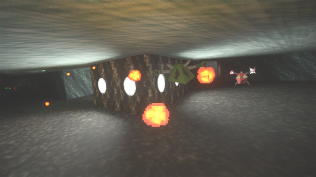

# DXX Raytracer-D2
DXX Raytracer-D2 is a fork of the [DXX Raytracer](https://github.com/BredaUniversityGames/DXX-Raytracer) project for Descent 1. It is in alpha state, it runs but has not been tweaked or tested. It might crash or become unplayable when playing the game.

## Installation
[Download d2x_raytracer.zip here.](https://github.com/arbruijn/DXX-Raytracer-D2/releases/latest) 

Extract the zip file to a location of your choosing, and add all the  .hog, .ham, .s22, .pig and .mvl files from your Descent 2 installation. Then run descent2.exe.

## Features
- Physically-based rendering
- Soft shadows
- Pathtraced global illumination
- Bloom
- Temporal anti-aliasing
- Motion blur
- Post-processing (Vignette, tonemap, etc.)

## Instructions
- SHIFT + ALT + F1: Open debug menus, more on those below
- SHIFT + ALT + F2: Toggle depth testing for debug lines
- SHIFT + ALT + F: Toggle free camera option
- F1: Menu with important keybindings from the game
- ALT + F2: Save your game
- ALT + F3: Load a save game

## Debug Menus
- Render Settings: All kinds of graphics settings and debug utility for rendering
- GPU Profiler: A profiling tool to see how much time individual render passes took on the GPU
- Material Editor: Adjust material properties from any level
- Polymodel Viewer: Allows you to view a polymodel in the current scene.
- Dynamic Lights: Allows for tweaking of dynamic lights, like weapons, explosions, and muzzle flashes.
- Light Explorer: Allows for tweaking of individual lights, and adds ability to debug view lights in the level.

## Texture compression - generating DDS textures
To create DDS textures: Download NVIDIA's https://developer.nvidia.com/gpu-accelerated-texture-compression to compress the textures. We have prepared a script for you to convert a batch of textures to the correct format and settings. You can run the python script in a command line ***python PNGToDDS.py \<path\>*** with a path to a directory that contain the PNGs to generate an nvtt file. That file can then be executed with ***nvtt_export --batch "DXX_Raytracer_Convert_PNG_To_DDS.nvtt"***. That will generate DDS files for all PNG files in that directory specified in the python script that follow our naming conventions (filename_basecolor.png, filename_normal.png, filename_metallic.png, filename_roughness.png, and filename_emissive.png) and use the correct settings for each of these types. If you do not decide to use our python script, make sure that you generate DDS files with mips already in them, and emissive textures should be pre-multiplied by their alpha.
